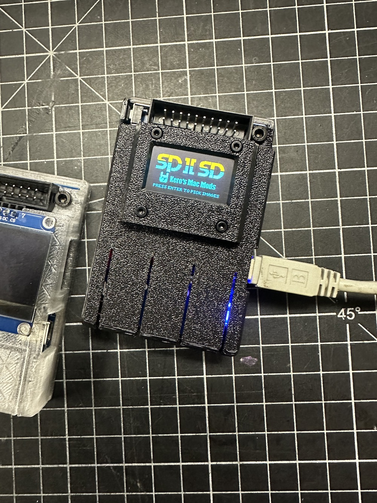
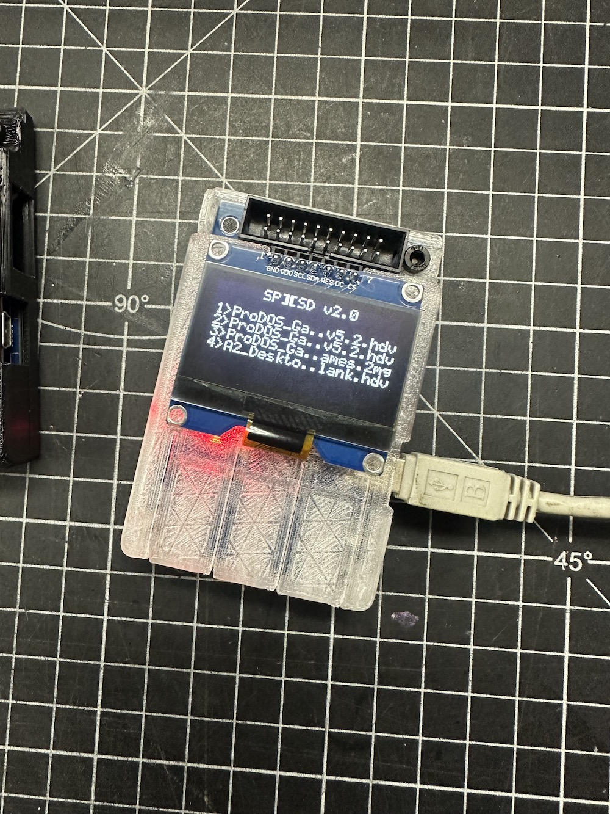

### Shell case

The 3D-printed shell case was designed by Alan Williams. Essentially, you only need to 3D print the top and bottom shells for use. The required screws are three M3-8mm cap bolts. A bezel is provided specifically for a 0.96" OLED display, which is secured with four M2-6mm to 12mm cap bolts.  

If you don't need the bezel you can use any size OLED.

