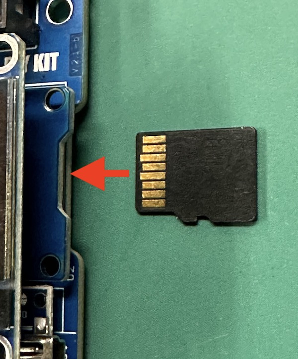
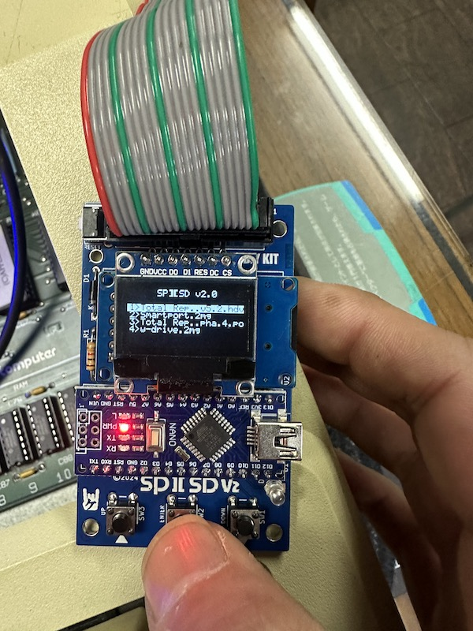
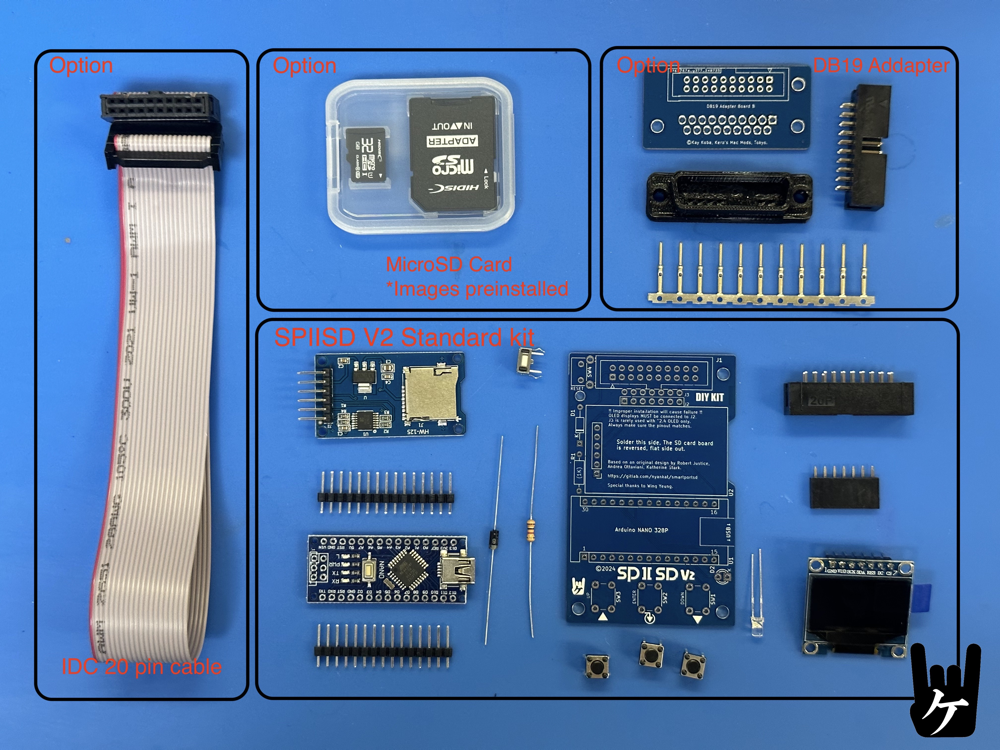
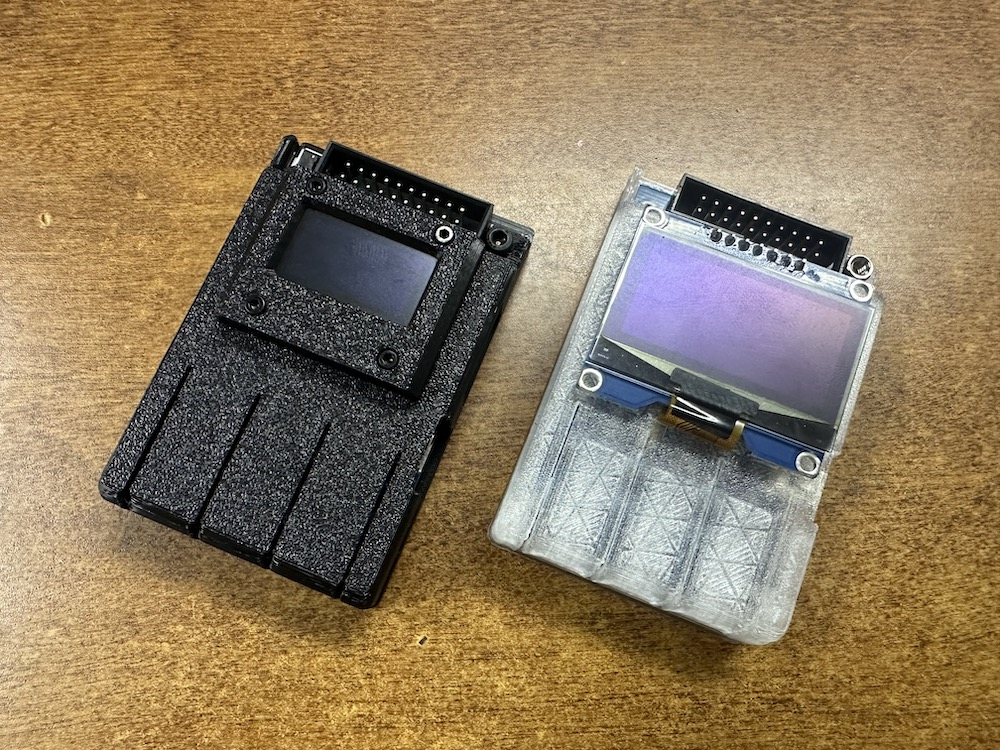
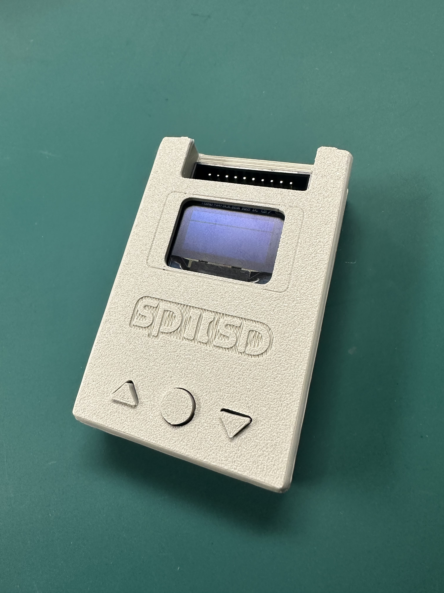

---

### SPIISD V2.0 Release Notes  

In SPIISD V1, it was not possible to visually inspect image files, and the V2 main goal was to operate the system using an LCD and buttons. However, some users experienced difficulties creating image files or made near-miss mistakes with file suffixes in the V1. In V2, there are no suffix rules for compatible image files, and users can simply select files using button operations.  

Please note that V2 is a closed-source release. For more details, please refer to [my blog](https://ameblo.jp/keroxiee1016/entry-12875583265.html). We would like to special thank [Wing Yeung](http://www.mfa2lab.com) for helping with the V2.0 program. 

---

### Upgrades in SPIISD V2.0  

- **Improved Usability**  
  The system now features LCD support and button operation, making it easier to use. SPI-compatible LCDs can be used, with [Three different size models](https://ameblo.jp/keroxiee1016/entry-12882949657.html) confirmed to work perfectly. A stylish splash screen is displayed immediately upon powering on. Unlike Version 1, there is no eject button; therefore, if you want to use a single image, make sure to place the boot image at the top of the list. The button operation has been simplified to GND control, significantly reducing the number of components required.  

- **Faster Performance**  
  The system has been optimized for IIc Plus and IIgs, offering improved speed.  

- **Error Alerts**  
  If there is an issue with the SD card or if no card is inserted, an alert will be displayed.  

- **Automatic Configuration**  
  There is no need for users to manually create a `config.txt` file—it is generated automatically. This eliminates the challenges beginners faced when creating optimized boot images. Now, users simply save disk images to the SD card and operate via buttons.  

- **Wide Compatibility**  
  Compatible with Apple II Plus, IIe, IIc, IIc Plus, and IIgs.  

- **User-Friendly Assembly**  
  The kit consists entirely of DIP components, with all parts placed on the top layer of the PCB. Soldering is done exclusively from the back layer of the PCB, requiring no advanced soldering skills. For users who are not confident in soldering, we also offer pre-assembled and tested SPIISD units with guaranteed functionality.  

For assembly and soldering instructions, please refer to the provided [**Assembly Guide**](https://github.com/kerokero5150/SPIISD_V2/blob/main/PDF/SP2SD＿V2_DIY_assembly%20guide1.pdf).  

---

### How to Use  

1. **Format the MicroSD Card**  
   Format the MicroSD card to FAT32 (FAT16 is also acceptable). Most commercially available SD cards are pre-formatted to FAT32. Place a 32MB ProDOS disk image file on the card. Supported file extensions for SPIISD are `.po`, `.2mg`, and `.hdv`.  

   In SPIISD V2, image files no longer need to be placed in the root directory. Files can be selected from subdirectories, allowing for better organization by creating folders on a PC.  

   For creating new image files, we recommend using DiskJockey:  
   [https://diskjockey.onegeekarmy.eu](https://diskjockey.onegeekarmy.eu)  

   While file suffixes are not restricted, please ensure file names use English alphanumeric characters. Non-English characters may cause garbled text.

   	Note: The SD card board is installed on the SPIISD main board upside down, so please remember to insert the SD card upside down as well. 
   

3. **Connect SPIISD to Apple II and Boot Up**  
   Ensure that there is no active access between Apple II and SPIISD during connection. Performing button operations on SPIISD while it is accessed by Apple II may cause the system to freeze. If a freeze occurs, power off the Apple II and restart.  

4. **File Selection**  
   When using a new SD card, pressing "Enter" on SPIISD will display empty slots for Disk 1 to 4. Press the corresponding number key to enter file selection mode, choose the desired file, and press "Enter."
   

5. **Automatic `config.txt` Creation**  
   Once a file is selected, a `config.txt` file will be generated in the root directory of the SD card. This file acts as an index of boot files. After setup, SPIISD will read the `config.txt` file on every boot.  

6. **Booting Based on Machine**  
   Boot order may vary depending on the Apple II model in use. For example:  
   - For Apple IIc with ROM 4x, the system automatically recognizes and boots.  
   - For Apple IIe with [Grappler Minus](https://en.infinityproducts.co.jp/product-page/grappler-minus-fully-assembled-card-or-bare-pcb)(SoftSP)and Disk II cards, press `CTL + RST` and input the command `PR#<Grappler Minus slot number>` to boot.  *If GrapplerMinus is inserted at slot number 5, it will become `PR#5`.
   - For other cards, refer to the card's instructions.
  
Detailed usage instructions [**here**](https://github.com/kerokero5150/SPIISD_V2/blob/main/PDF/SPIISD_INST1.pdf).
---
### Where to buy

You can buy it in [our store](https://en.infinityproducts.co.jp/product-page/spiisd-v2-diy-kit). The standard kit is 32 USD. V2 to DB19 adapter is optional (8 USD).  

 
---
### 3D Printed Shell Case

Alan Williams's [Case](https://github.com/kerokero5150/SPIISD_V2/tree/main/Case)  
   
Stephen Arsenault's [Case](https://makerworld.com/en/models/1227482-spiisd-v2-shell#profileId-1245605)  

---
## Model-specific tips and known issues

### For Using with the IIc Plus
To launch Smartport, press `Open-Apple + Control + Reset` . Maybe it takes some getting used to, but if you hold down `Open-Apple + Control + Reset`, then release the other keys keep holding `Open-Apple`, and finally release `Open-Apple`, it should work.

### For Using with the IIgs:
Firmware up to V2.01 has a timing issue with only IIgs. *Other AppleII-models can be booted without any timing issues. 
Normally, when the IIgs cannot detect a bootable device, "**Check Startup Device!**" is displayed.
But you can restart it by pressing `Command (Open-Apple) + Control + Power Key` at the same time to boot correctly. We are currently shipping V2.02, but the very first few units may be V2.01. If your SPIISD is using firmware earlier than V2.01, an update is possible, so please [contact us](https://www.kerosmm.com/お問い合わせ).  
If the SPIISD does not work on your IIgs, remove any other boot devices or boot cards. 
Additionally, try the following steps: Press `Command (Open-Apple) + Control + Escape` to access the Control Panel. In the Slots menu, set Startup Slot to **5** or **Auto**.  

### For Apple II Desktop Users: 
Please note that in Apple II Desktop, go to `Control Panel > Options > Copy to RAM Card (if present)` and ensure it is turned **off**. If this option is set to **on**, it has been confirmed that SPIISD will not be recognized and the system will fail to boot.  

Do not press the SPIISD buttons while both the SPIISD and the Apple II are accessing data (when the LED is blinking). Doing so may cause both devices to freeze, or one of them to freeze. In such cases, turn off the power and restart from the beginning. To prevent the Apple II from accessing the Smartport, it is recommended to first hold down `Control + Reset`.  

---

SPIISD V2 is based on an open source project [SmartPortSD](https://gitlab.com/nyankat/smartportsd). Special thanks to: Robert Justice, Andrea Ottaviani and Katherine Stark.

(C) 2025 Kero's Mac Mods, Kay Koba

