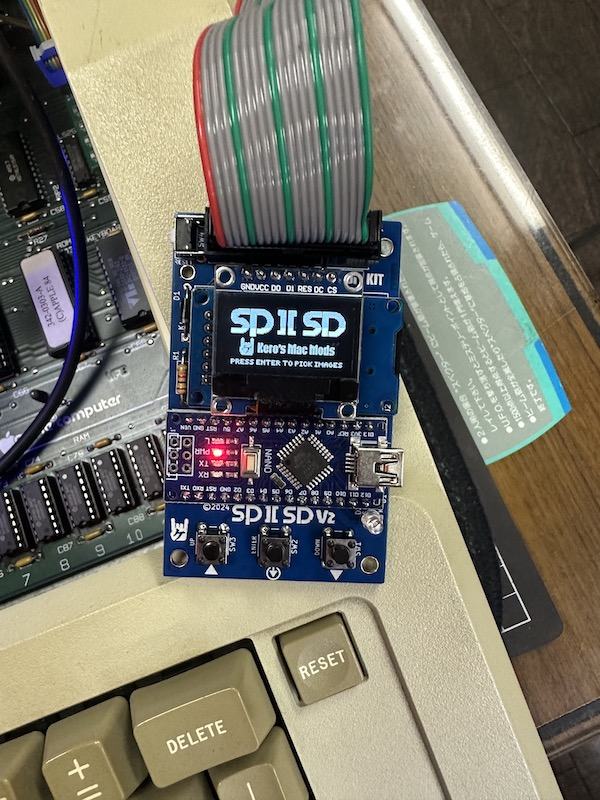
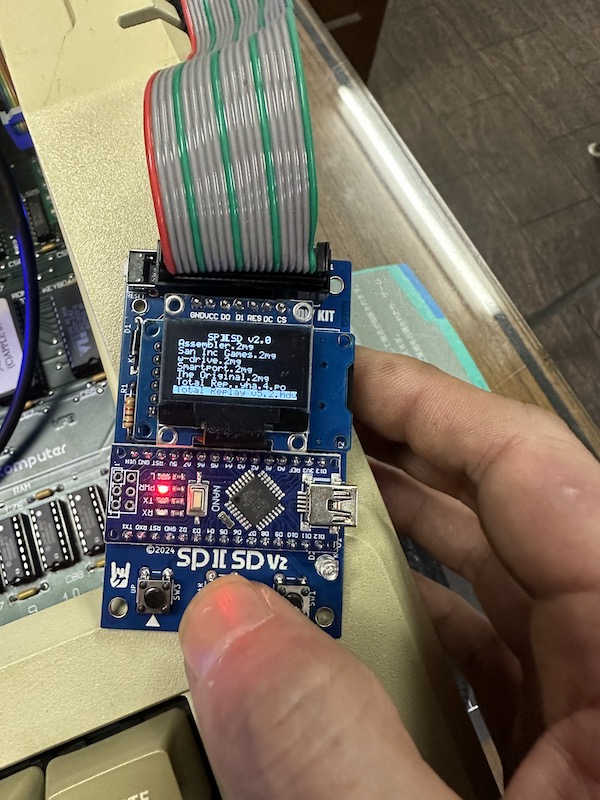

---

### SPIISD V2.0 Release Notes  

In [V1](https://github.com/kerokero5150/SP2SD_DIY_KIT), it was not possible to visually inspect image files, and the main goal was to operate the system using an LCD and buttons. However, some users experienced difficulties creating image files or made near-miss mistakes with file suffixes. In V2, there are no suffix rules for compatible image files, and users can simply select files using button operations.  

Please note that V2 is a closed-source release. For more details, please refer to [my blog](https://ameblo.jp/keroxiee1016/entry-12875583265.html).  

---

### Upgrades in SPIISD V2.0  

- **Improved Usability**  
  The system now features LCD support and button operation, making it easier to use. SPI-compatible LCDs can be used, with three models confirmed to work perfectly. A stylish splash screen is displayed immediately upon powering on. Unlike Version 1, there is no eject button; therefore, if you want to use a single image, make sure to place the boot image at the top of the list. The button operation has been simplified to GND control, significantly reducing the number of components required.  

- **Faster Performance**  
  The system has been optimized for IIc Plus and IIgs, offering improved speed.  

- **Error Alerts**  
  If there is an issue with the SD card or if no card is inserted, an alert will be displayed.  

- **Automatic Configuration**  
  There is no need for users to manually create a `config.txt` file—it is generated automatically. This eliminates the challenges beginners faced when creating optimized boot images. Now, users simply save disk images to the SD card and operate via buttons.  

- **Wide Compatibility**  
  Compatible with Apple II Plus, IIe, IIc, IIc Plus, and IIgs.  

- **User-Friendly Assembly**  
  The kit consists entirely of DIP components, with all parts placed on the top layer of the PCB. Soldering is done exclusively from the back layer, requiring no advanced soldering skills. For users who are not confident in soldering, we also offer pre-assembled and tested SPIISD units with guaranteed functionality.  

For assembly and soldering instructions, please refer to the provided **Assembly Guide**.  

---

### How to Use  

1. **Format the MicroSD Card**  
   Format the MicroSD card to FAT32 (FAT16 is also acceptable). Most commercially available SD cards are pre-formatted to FAT32. Place a 32MB ProDOS disk image file on the card. Supported file extensions for SPIISD are `.po`, `.2mg`, and `.hdv`.  

   In Version 2, image files no longer need to be placed in the root directory. Files can be selected from subdirectories, allowing for better organization by creating folders on a PC.  

   For creating new image files, we recommend using DiskJockey:  
   [https://diskjockey.onegeekarmy.eu](https://diskjockey.onegeekarmy.eu)  

   While file suffixes are not restricted, please ensure file names use English alphanumeric characters. Non-English characters may cause garbled text.  

2. **Connect SPIISD to Apple II and Boot Up**  
   Ensure that there is no active access between Apple II and SPIISD during connection. Performing button operations on SPIISD while it is accessed by Apple II may cause the system to freeze. If a freeze occurs, power off the Apple II and restart.  

3. **File Selection**  
   When using a new SD card, pressing "Enter" on SPIISD will display empty slots for Disk 1 to 4. Press the corresponding number key to enter file selection mode, choose the desired file, and press "Enter."  

4. **Automatic `config.txt` Creation**  
   Once a file is selected, a `config.txt` file will be generated in the root directory of the SD card. This file acts as an index of boot files. After setup, SPIISD will read the `config.txt` file on every boot.  

5. **Booting Based on Machine**  
   Boot order may vary depending on the Apple II model in use. For example:  
   - For Apple IIc with ROM 4x, the system automatically recognizes and boots.  
   - For Apple IIe with SoftSP (Grappler Minus) and Disk II cards, press `CTL + RST` and input the command `PR#<SoftSP card slot number>` to boot.  
   - For other cards, refer to the card's instructions.  
